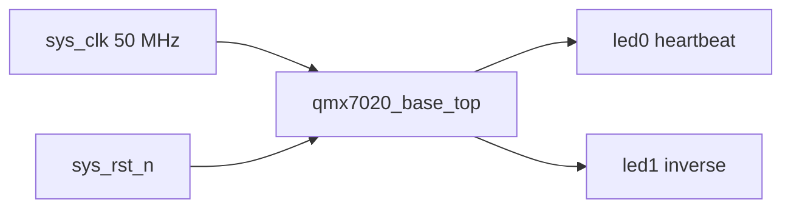

# Architecture

## Module Boundaries

- `qmx7020_base_top`: board-facing top-level ports and heartbeat logic.
- Future project modules should be added under `02_vivado/rtl/` and instantiated from the top module.

## Design Rule

Keep the first bring-up path small. Add one feature, simulate it, then integrate it into the board-level top.
